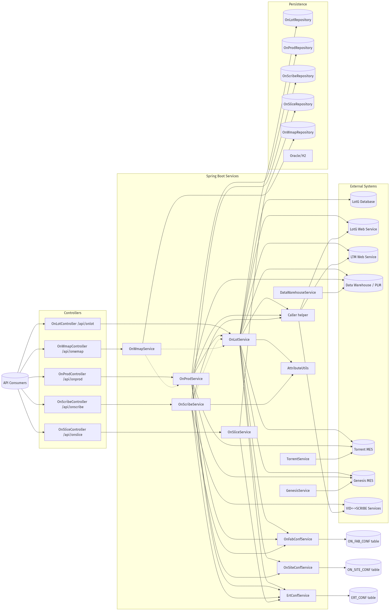

# Exensio Reference Tables Web Service

Top-level view of the Exensio Reference Tables (ERT) web service, covering its REST surface, orchestration services, shared infrastructure, and external data providers.



## Platform Snapshot

- Spring Boot 2.x application exposing REST endpoints under `/api/**`.
- Oracle (production) or H2 (local) database stores reference-table entities.
- Controllers normalise inputs, delegate to domain services, and emit DTOs with status flags.
- Services enrich data by combining cached records with external systems (LotG, LTM, Data Warehouse, MES, VID↔SCRIBE).
- Configuration tables (`ON_FAB_CONF`, `ON_SITE_CONF`, `ERT_CONF`, `ON_PROD_CONF`) dictate which integrations fire per fab, data type, or site.

## REST Domains

| Domain | Primary Endpoints | Responsibilities | Key Entities |
| --- | --- | --- | --- |
| Lot (`/api/onlot`) | `bylotid`, `all`, `byid` | Builds lot records from LotG DB/WS, LTM, Torrent/Genesis, Data Warehouse; seeds OnProd cache. | `OnLot`, `OnProd` companion |
| Prod (`/api/onprod`) | `byproduct`, `all`, `byid` | Extends OnLot with product-centric overrides and Data Warehouse metadata. | `OnProd` |
| Scribe (`/api/onscribe`) | `bylotidandwafernum`, `byscribeid`, `bystdfinfo` | Resolves wafer IDs via VID↔SCRIBE services or calculates fallbacks using OnLot cache. | `OnScribe` |
| Slice (`/api/onslice`) | `byslice`, `byglobalwaferid`, `create`, `update` | Maintains slicing metadata (slice IDs, puck/run info, global wafer IDs). | `OnSlice` |
| Wafer map (`/api/onwmap`) | `bylotid`, `byscribeid` | Supplies wafer-map references combining LotG, OnLot, and remote map stores. | `OnWmap` |
| Configuration (`/api/onfabconf`, `/api/onsiteconf`, `/api/ertconf`) | CRUD endpoints | Manage fab/site-level toggles that drive enrichment logic. | `OnFabConf`, `OnSiteConf`, `ErtConf` |

## Service Layer Responsibilities

- **OnLotService** – orchestrates the most complex flow; acts as the central cache feeding OnProd, OnScribe, and OnWmap.
- **OnProdService** – layers Data Warehouse attributes and Torrent/Genesis details on top of OnLot-derived records; persists both lot and product views.
- **OnScribeService** – resolves wafer IDs using VID↔SCRIBE services, falling back to calculated patterns with help from cached OnLot source lots.
- **OnSliceService** – provides CRUD-style management without external dependencies.
- **OnWmapService** – ties lot/product context back to wafer-map repositories, driven by OnLot and OnProd data.
- **Caller helper** – centralises outbound HTTP/SOAP calls (LotG WS, LTM, VID↔SCRIBE, Genesis) and field-mapping utilities.

## Shared Infrastructure

| Component | Purpose |
| --- | --- |
| `OnFabConfService` | Determines fab/data-type-specific settings (lot selection rules, URLs, result types, lot-trim heuristics, wafer ID equality flags).
| `OnSiteConfService` | Supplies site-level connection details (MES database connectivity, MES type, lot trimming regexes).
| `ErtConfService` | Provides global defaults (service URLs, feature toggles) when fab/site configs are absent.
| `DataWarehouseService` | Retrieves PLM and manufacturing-area metadata for lots/products when missing locally.
| `TorrentService` / `GenesisService` | Query MES backends for product/process/technology overrides, keyed by site configuration.
| `AttributeUtils` | Offers deterministic fallbacks (wafer ID calculation, JND/Bucheon lot trimming).
| `DateUtils` | Parses user-supplied timestamps during create/update flows.

## Request Lifecycle (Typical Enriched Flow)

1. **Controller** upper-cases textual inputs and logs the request.
2. **Service** checks the repository; `Status.isFoundAll()` short-circuits repeat lookups.
3. **Configuration** data is loaded (fab/site/global) to decide which external calls apply and which identifiers to pass downstream.
4. **External calls** execute in priority order (LotG native DB → LotG WS → LTM → Data Warehouse → MES → VID↔SCRIBE), folding results onto domain objects.
5. **Utility mappers** (`Caller.assign*`) harmonise source data, ensuring OnLot and OnProd remain aligned.
6. **Status resolution** marks successes/failures (e.g., `LOTG_MES_LTM_DW`, `FOUND`, `NO_DATA`).
7. **Persistence** writes entities back through repositories; services return DTOs for HTTP responses.

## External Systems & Access Paths

| System | Accessor | Triggered From | Notes |
| --- | --- | --- | --- |
| LotG database | `LotgInfoCustomRepository` | OnLot/OnProd | Native SQL against foundry tables; supports alternate lot formats and site trimming.
| LotG web service | `Caller.getLotg` | OnLot/OnProd | Adds manufacturing lot linkages when DB lacks data.
| LTM web service | `Caller.getLtm` | OnLot/OnProd | Supplies lot-type attributes.
| Data Warehouse (PLM/Mfg Area) | `DataWarehouseService` | OnLot/OnProd | Enriches part descriptions, mask sets, PAL4 codes.
| Torrent MES | `TorrentService.getMesDto` | OnLot/OnProd | Runs site-specific SQL for product/process/technology overrides.
| Genesis MES | `GenesisService.getMesDto` | OnLot/OnProd | SOAP/REST call alternative when `mesType=GENESIS`.
| VID↔SCRIBE services | `Caller.getWaferIdByLotAndWaferNum`, `Caller.getWaferIdByScribeId` | OnScribe | URL templates sourced from `ON_FAB_CONF` or `ERT_CONF`.

## Persistence & Status Conventions

- Each domain entity tracks `Status` enums summarising source coverage (`FOUND`, `LOTG_MES_LTM_DW`, `NO_DATA`, `ERROR`, `MANUAL`).
- Repositories act as caches; enrichment services avoid overwriting manual entries and stop early when data is already complete.
- `insertTime` timestamps use `DateUtils.getSqlDateNow()` on modification; create/update flows reject malformed timestamps.

## Diagram Regeneration

Mermaid source is stored in `docs/ert-overview.mmd`. After edits run:

```bash
jq -Rs '{diagram_source: .}' docs/ert-overview.mmd > /tmp/ert-overview.json
curl -s -H 'Content-Type: application/json' --data @/tmp/ert-overview.json \
  https://kroki.io/mermaid/png --output docs/ert-overview.png
```
