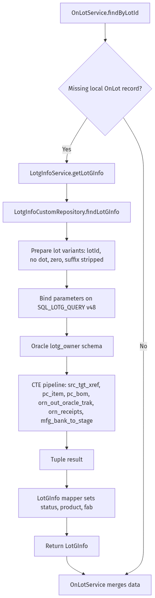

# LotG Lookup Reference

This document captures the specifics of how the Exensio Reference Tables service retrieves genealogy data from the LotG system.

## Call Chain

- `OnLotService.findByLotId` requests LotG enrichment when local data is missing.
- `LotgInfoService.getLotGInfo` logs the inbound lot ID and calls the repository.
- `LotgInfoCustomRepository.findLotGInfo` executes a native SQL statement through the `lotGEntityManager`.
- The native query runs against the Oracle schema `lotg_owner` and projects a single row into `LotGInfo`.



## SQL Summary

- Query constant: `SQL_LOTG_QUERY` (version tag `v48`).
- Located in `src/main/java/com/onsemi/cim/apps/exensioreftables/ws/repository/lotg/LotgInfoCustomRepository.java`.
- Uses a series of CTEs to walk genealogy, reconcile bank data, and enrich lots with manufacturing metadata.
- Targets tables including `src_tgt_xref`, `pc_item`, `pc_bom`, `orn_out_oracle_trak`, `orn_receipts`, and `mfg_bank_to_stage`.

### Lot ID Variants

Before execution the repository creates four parameter variants to address historical formatting changes:

1. Original lot ID (e.g., `KG15Z1UXZA`).
2. Without dot (`lotIdWithoutDot`).
3. Dot replaced with `0` (`lotIdWith0`).
4. Suffix stripped of alphabetic characters (`lotIdWithoutDotAndLettersInSuffix`).

Each variant binds to the query so that decade rollover and vendor formatting still match genealogy rows.

### Result Mapping

Returned tuple columns populate the `LotGInfo` model:

- `LOT` → `LotGInfo.lot`
- `PRODUCT` → `LotGInfo.product`
- `SOURCE_LOT` → `LotGInfo.sourceLot`
- `WAFER_PART/ALTERNATE_PRODUCT` → `LotGInfo.waferPartAlternateProduct`
- `FAB` → `LotGInfo.fab`
- `LOT_TYPE` → `LotGInfo.lotType`
- `LOT_CLASS` → `LotGInfo.lotClass`
- `MASKSET` → `LotGInfo.maskSet`
- `PRODUCT_CODE` → `LotGInfo.productionCode`

If no row is returned, the repository yields `null` and the caller continues with DataWarehouse or MES fallbacks.

## Regeneration

The mermaid source for the diagram lives in `docs/lotg-query.mmd`. After editing, regenerate the PNG with:

```bash
jq -Rs '{diagram_source: .}' docs/lotg-query.mmd > /tmp/lotg-query.json
curl -s -H 'Content-Type: application/json' --data @/tmp/lotg-query.json https://kroki.io/mermaid/png --output docs/lotg-query.png
```
