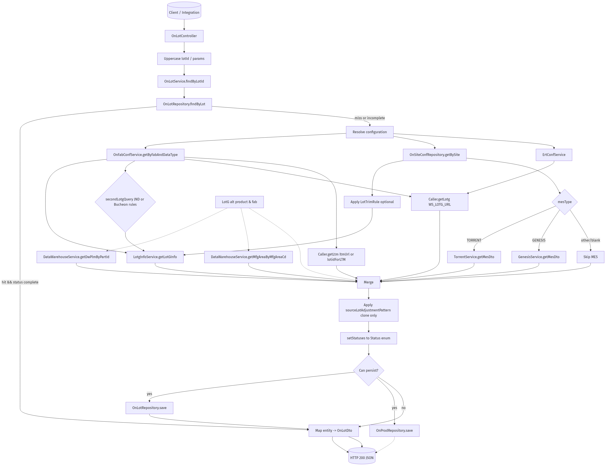

# OnLot Retrieval & Enrichment

Detailed behaviour of the `OnLot` API (`/api/onlot/bylotid`) and the enrichment pipeline that merges LotG, LTM, Data Warehouse, and MES sources before persisting results.

## REST Entry Points

- `GET /api/onlot/all` – dumps the local cache (`OnLotRepository.findAll`).
- `GET /api/onlot/byid/{id}` – returns a single record by surrogate ID.
- `GET /api/onlot/bylotid/{lotId}` – primary lookup that drives the enrichment workflow documented here.

Each request normalises textual inputs to upper-case and delegates to `OnLotService.findByLotId(lotId, alternateProduct, fab, dataType, site, onlyFromDb=false)`.



## Control Flow Inside `OnLotService.findByLotId`

1. **Initial local hit** – attempt `OnLotRepository.findByLot(lotId)`. If `onlyFromDb=true` the method returns here.
2. **Status check** – if the record is missing or its `Status` is not "found everywhere" the service proceeds to enrichment.
3. **LotG lookup** – `LotgInfoService.getLotGInfo(lotVariant)` runs the native SQL in `LotgInfoCustomRepository` using up to four lot formats. `LotIdForLotGWS` in `ON_FAB_CONF` may force use of the manufacturing lot when a cached row already exists.
4. **Site-specific trimming** – optional `ON_SITE_CONF.lotTrimRule` can transform the lot before calling LotG; JND/Bucheon second-pass logic applies additional heuristics when `ON_FAB_CONF.secondLotgQuery=true`.
5. **LTM call** – `Caller.getLtm(ltmUrl, lot)` hits the LTM web service chosen by `ON_FAB_CONF.ltmUrl`. `LotIdForLTM` controls whether `lot` or `mfgLot` is used.
6. **LotG reference data** – `Caller.getLotg` fetches foundry/fab lots via the `WS_LOTG_URL` constant stored under `ERT_CONF` (unless DB already has mfg-lot info).
7. **Data Warehouse** – `DataWarehouseService.getDwPlmByPartId(alternateProduct)` and `getMfgAreaByMfgAreaCd(fab)` load PLM and manufacturing-area descriptors when not already present.
8. **MES integration** – if `site` is supplied the service loads `ON_SITE_CONF`:
   - `mesType=TORRENT` → `TorrentService.getMesDto` runs the site-specific SQL against the Torrent MES DB, returning lot, product, process, technology, PTI code, and mask set.
   - `mesType=GENESIS` → `GenesisService.getMesDto` calls the Genesis MES service.
   - Missing or other types skip MES, but statuses acknowledge MES availability.
9. **Prioritised merge** – `Caller` utilities align and prioritise results:
   - `assignLotGInfoResults` seeds `OnLot`/`OnProd` with LotG product/fab/source-lot data.
   - `assignLotgResults` adds manufacturing lot info from the LotG web service.
   - `assignLtmResults` enriches lot type.
   - `assignDwhpResults` and `assignDwMfgaResults` pull PLM/mfg-area metadata.
   - `assignMesResults` overlays MES values (process, technology, product version, PTI, mask set).
10. **Source-lot adjustments** – `ON_FAB_CONF.sourceLotAdjustmentPattern` can alter only the returned DTO (clone) while leaving the persisted entity intact.
11. **Status resolution** – `setStatuses` evaluates which sources succeeded (LotG, MfgLot, MES, LTM, DW) and assigns a composite enum like `LOTG_MFGLOT_MES_LTM_DW`.
12. **Persistence** – if the final `OnLot` has a non-empty `lot` and the pipeline either succeeded or properly skipped MES, the entity is saved; the companion `OnProd` (built concurrently) is also persisted when populated.

## Key Configuration/Data Sources

| Source | Access Path | Configuration | Data Returned |
| --- | --- | --- | --- |
| LotG native DB | `LotgInfoCustomRepository.SQL_LOTG_QUERY` | Uses hard-coded SQL; optional `ON_FAB_CONF.secondLotgQuery`, site trim rules | Product, fab, source lot, wafer-part alt product, lot class/type, mask set, production code |
| LotG Web Service (MFG Lot) | `Caller.getLotg` | `ERT_CONF.WS_LOTG_URL`; `ON_FAB_CONF.lotidForLotGWS` | Foundry/fab lot pairings, used to populate `mfgLot` |
| LTM Web Service | `Caller.getLtm` | `ON_FAB_CONF.ltmUrl`; `ON_FAB_CONF.lotidForLTM` | Lot type metadata |
| Data Warehouse | `DataWarehouseService` | `onlot` status gating; needs LotG alt product & fab code | PLM attributes (mask set, PAL4, part class/type, description) and mfg area descriptors |
| Torrent MES | `TorrentService.getMesDto` | `ON_SITE_CONF` (driver, URL, credentials, SQL) | Lot, fab, product, product version, family, lot type, process, technology, PTI, mask set |
| Genesis MES | `GenesisService.getMesDto` | `ON_SITE_CONF.mesType=GENESIS` | Same logical fields as Torrent via SOAP/REST |
| Alternate product override | Request parameter or fallback | Provided by caller | Used when LotG / MES do not supply product ID |

## Source-Lot Formatting Heuristics

- JND sites (fab codes beginning with `JND`) can trigger a second LotG query: `AttributeUtils.getNewJNDLotFromOldLot` derives the new lot format.
- Bucheon (`fab` contains `BUCHEON` and starts with `KR`) applies regex rules to strip or replace characters based on USME lot patterns.
- `ON_SITE_CONF.lotTrimRule` (parsed into `LotTrimRule`) allows per-site trimming before LotG calls.

## Status Semantics

`Status` flags combine data source contributions:

- `LOTG_*` components indicate `LotgInfo` or manufacturing lot data succeeded.
- `_MES` suffixes show Torrent/Genesis calls either succeeded or were available/called.
- `_LTM`, `_DW`, `_MFGLOT` portions reflect LTM, Data Warehouse, and LotG mfg-lot fetches.
- `MANUAL` overrides prevent automatic overwrites when the user set a record manually.

## Regenerating the Diagram

Mermaid source lives in `docs/onlot-dataflow.mmd`. After edits run:

```bash
jq -Rs '{diagram_source: .}' docs/onlot-dataflow.mmd > /tmp/onlot-dataflow.json
curl -s -H 'Content-Type: application/json' --data @/tmp/onlot-dataflow.json \
  https://kroki.io/mermaid/png --output docs/onlot-dataflow.png
```