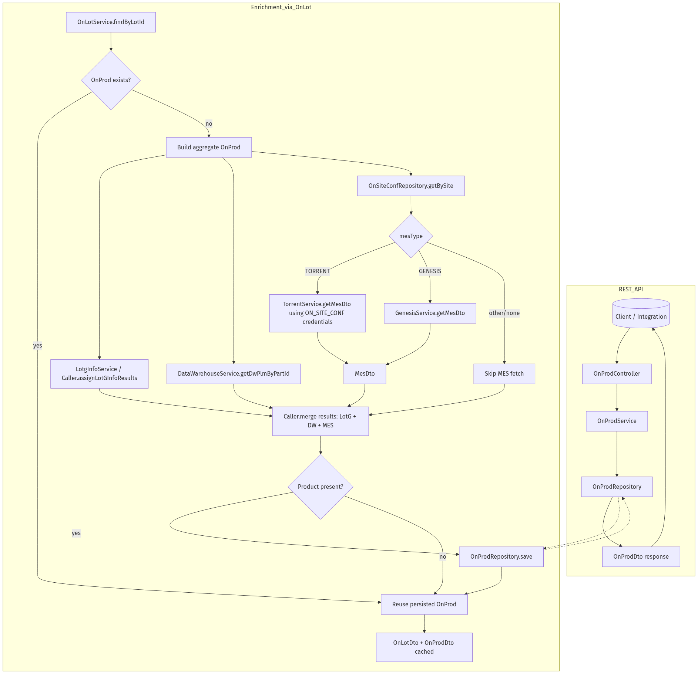

# OnProd Retrieval & Enrichment

This note explains how `ON_PROD` records are exposed via the REST API and how they are populated when a lot lookup triggers upstream services (Data Warehouse, Torrent, Genesis, LotG) inside `OnLotService`.

## REST Endpoints

- `GET /api/onprod/all` – returns every product entry (`OnProdController.all`).
- `GET /api/onprod/byid/{id}` – loads a record by the internal surrogate key.
- `GET /api/onprod/byproduct/{product}` – resolves a product by code; the controller normalises input to upper-case before delegating to `OnProdService.findByProduct`.

Each endpoint ultimately uses `OnProdRepository` (Spring Data JPA) for reads. If no entity is found, a DTO is returned with `Status.NO_DATA`.



## When Are OnProd Rows Populated?

The application does not call Torrent or Genesis directly from the `/api/onprod` endpoints. Instead, enrichment happens inside `OnLotService.findByLotId` whenever an `ON_LOT` lookup needs product data:

1. **Initial lookup** – `OnProdRepository.findByProduct` is checked first.
2. **LotG / Data Warehouse** – if the lot pipeline pulls alternate product information (`LotgInfo`, `DataWarehousePlm`), those results update the in-memory `OnProd` aggregate.
3. **MES integration** – if the referenced site has a record in `ON_SITE_CONF`, the service inspects `mesType`:
  - `GENESIS` → `GenesisService.getMesDto(site, lot)` (SOAP/REST client) fills MES DTO fields.
  - `TORRENT` → `TorrentService.getMesDto(site, lot)` opens a JDBC connection defined by `ON_SITE_CONF` and executes `SQL_LTM_PRODUCT_REPLACEMENT` to retrieve product metadata.
  - Other values → MES is skipped.
4. **Merge rules** – the `Caller` helper copies MES, Data Warehouse, and LotG facts onto both `OnLot` and `OnProd`, following a priority order (MES overrides DW overrides LotG, etc.).
5. **Persistence** – if the merged `OnProd` now has a non-empty `product`, `OnProdRepository.save` is invoked so future REST calls can read from the local database.

## Data Warehouse Participation

`OnLotService.findByLotId` calls `DataWarehouseService` whenever the current `OnLot`/`OnProd` status indicates Data Warehouse enrichment has not already happened:

- **Input**: the product identifier returned by LotG (`LotGInfo.getWaferPartAlternateProduct`) becomes the `partId` parameter.
- **Calls**:
  - `DataWarehouseService.getDwPlmByPartId(partId)` → uses `DataWarehouseCustomRepository.getDwPlmByPartId`. The XML-backed `DataWarehousePlm` model includes attributes such as `ERP_RESOURCE_FAB_CD`, `FAB_SITE_ID`, `MASK_SET_NO_PART_VAL`, `PAL4_CD`, `FAM_PLATFORM_GROUP_TYPE`, `PART_DESC`, `PART_TYPE`, and other descriptors used for die/wafer context.
  - `DataWarehouseService.getMfgAreaByMfgAreaCd(fab)` → maps the fab code to a descriptive record (`DataWarehouseMfgArea`) with `MFG_AREA_DESC`, `MFG_AREA_TYPE_CD`, and `COUNTRY_CD`.
- **Usage**: the shared `Caller` helper pushes these values onto `OnProd` and `OnLot` via `assignDwhpResults` and `assignDwMfgaResults`, filling fields like `maskSet`, `technology`, `family`, `fab`, and descriptive metadata used by callers.

## Torrent MES Participation

For sites configured with `MES_TYPE = TORRENT` in `ON_SITE_CONF`, the enrichment pipeline pulls product details directly from the Torrent MES database:

| ON_SITE_CONF Column | Purpose |
| --- | --- |
| `DRIVER_CLASS_NAME` | JDBC driver class for the site-specific Torrent database. |
| `CONNECTION_STRING` | JDBC URL, typically pointing at Oracle or SQL Server instances. |
| `DB_USERNAME` / `DB_PASSWORD` | Credentials used by `TorrentSiteDataSources` to build a pooled connection. |
| `SQL_LTM_PRODUCT_REPLACEMENT` | Parameterised SQL query executed with the lot ID. |

`TorrentService.getMesDto(site, lot)` obtains a connection and executes the configured statement. The result set populates `MesDto` columns:

- `LOTID` → `MesDto.lot`
- `SRC_FAB` → `MesDto.fab`
- `PARTNAME` → `MesDto.product`
- `PARTVERSION` → `MesDto.productVersion`
- `FAMILY` → `MesDto.family`
- `LOT_TYPE` → `MesDto.lotType`
- `PROCESS` → `MesDto.process`
- `TECHNOLOGY` → `MesDto.technology`
- `PTI_CODE` → `MesDto.pti4`
- `MASK_SET` → `MesDto.maskSet`

The `Caller.assignMesResults` method merges these MES values into the `OnProd` entity, overriding Data Warehouse or LotG fields when present.

## Genesis MES Participation

If `MES_TYPE = GENESIS`, `OnLotService` calls `GenesisService.getMesDto(site, lot)` (SOAP/REST client). Although the implementation differs, it returns the same `MesDto` structure as Torrent. The `Caller.assignMesResults` path is identical, ensuring consistent downstream mapping.

## LotG & Additional Inputs

- **LotGInfo** – retrieved through `LotgInfoService.getLotGInfo`. Supplies initial product and fab codes used to seed both `OnLot` and `OnProd`.
- **LTM Web Service** – when configured via `OnFabConf`, the LTM payload adds lot-type information merged into the DTO.
- **Alternate Product** – user-supplied or LotG-sourced fallback used if neither MES nor Data Warehouse provides a product code.

## Torrent Configuration Details

`TorrentService` relies on runtime configuration stored in `ON_SITE_CONF`:

| Column | Purpose |
| --- | --- |
| `MES_TYPE` | Selects Torrent vs Genesis; must be `TORRENT` for this path. |
| `DRIVER_CLASS_NAME`, `CONNECTION_STRING`, `DB_USERNAME`, `DB_PASSWORD` | Used to construct a site-specific JDBC connection pool (`TorrentSiteDataSources`). |
| `SQL_LTM_PRODUCT_REPLACEMENT` | Query executed with the lot ID as bind parameter; returns part, family, process, technology, PTI code, etc. |

The resulting `MesDto` is consumed by `Caller.assignMesResults`, which maps fields such as `product`, `family`, `process`, `technology`, and `maskSet` onto the `OnProd` entity.

## Diagnostics & Status

- Successful enrichment sets `Status` on both `OnLot` and `OnProd` to a composite value like `LOTG_MFGLOT_MES_LTM_DW`, reflecting which upstream systems responded.
- If Torrent/Genesis calls fail, the service logs the problem and falls back to previously cached data (LotG, DataWarehouse) before returning.
- Manual edits (status `MANUAL`) are preserved because `setOnLotOnProdStatus` will not override manual entries.

## Regenerating the Diagram

Mermaid source lives in `docs/onprod-dataflow.mmd`. After edits run:

```bash
jq -Rs '{diagram_source: .}' docs/onprod-dataflow.mmd > /tmp/onprod-dataflow.json
curl -s -H 'Content-Type: application/json' --data @/tmp/onprod-dataflow.json \
  https://kroki.io/mermaid/png --output docs/onprod-dataflow.png
```
