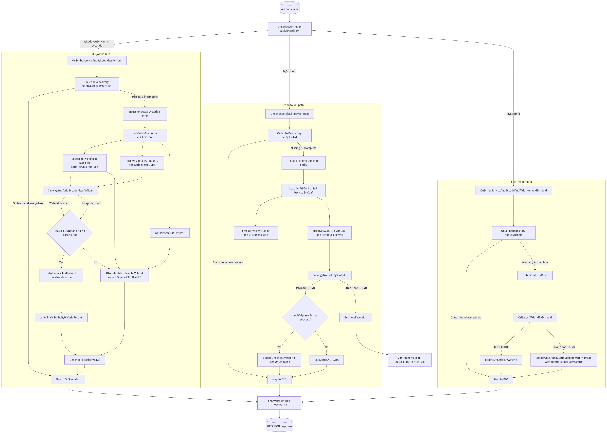

# OnScribe Retrieval & Wafer Resolution

End-to-end behaviour of the `OnScribe` REST layer and the wafer-identification pipeline that reconciles VID, scribe ID, and calculated wafer IDs using configuration-driven rules.

## REST Entry Points

- `GET /api/onscribe/all` – dumps every cached record via `OnScribeRepository.findAll`.
- `GET /api/onscribe/byid/{id}` – loads a specific entity by the surrogate key.
- `GET /api/onscribe/bylotidandwafernum/{lotId}/{waferNum}` – canonical lookup when only the production lot is known.
- `GET /api/onscribe/bylotidsandwafernum?lotId&waferNum&mfgLot` – allows callers to supply both the production lot and its manufacturing counterpart.
- `GET /api/onscribe/byscribeid/{scribeId}` – resolves a VID/lot pair when only the scribe mark is provided.
- `GET /api/onscribe/bystdfinfo/{lotId}/{waferNum}/{scribeId}` – STDF helper that attempts the scribe lookup first but falls back to a calculated wafer ID when the external call fails.

Every endpoint upper-cases inbound strings before delegating to `OnScribeService`, which encapsulates the enrichment logic illustrated below.



## `OnScribeService.findByLotAndWaferNum`

1. **Repository probe** – call `OnScribeRepository.findByLotAndWaferNum`. When a row exists and `Status.isFoundAll()` is true, the service returns immediately.
2. **Entity bootstrap** – reuse the partially populated entity or instantiate a fresh `OnScribe` and stamp `insertTime`.
3. **Configuration handshake** – `OnFabConfService.getByFabAndDataTypeOrFabOnly` determines:
   - Which lot identifier to pass downstream (`LotIdForOnScribeType` toggles between production and manufacturing lot).
   - Whether the wafer ID must equal the scribe ID (`onScribeWaferIdEqualsScribeId`).
   - The VID→SCRIBE endpoint (`vid2ScribeUrl`) and expected payload style (`ScribeResultType`).
   - Optional `waferIdCreationPattern` overrides for calculated fallbacks.
   Missing `OnFabConf` entries fall back to `ErtConfService` URLs and default result types.
4. **External VID lookup** – `Caller.getWaferIdByLotAndWaferNum` invokes the chosen VID→SCRIBE service. Any exception is logged; the pipeline keeps going with a calculated fallback.
5. **OnLot context** – request `OnLotService.findByLotId(..., onlyFromDb=true)` to borrow cached `sourceLot` and LotG metadata without triggering new remote calls.
6. **Success path** – when the VID service returns a payload without a `No LaserScribe` error, `Caller.fillOnScribeByWaferIdResults` copies the response into the entity, optionally mirroring wafer ID into the scribe ID.
7. **Fallback path** – when the VID service fails, `AttributeUtils.calculateWaferId` synthesises a wafer ID using the (possibly trimmed) lot, wafer number, cached `sourceLot`, and `waferIdCreationPattern`. The entity is marked with `WaferIdSource.CALCULATED`.
8. **Persistence & response** – save through `OnScribeRepository.save` and wrap the entity in `OnScribeDto` for the controller response.

## `OnScribeService.findByScribeId`

1. **Repository reuse** – `OnScribeRepository.findByScribeId` short-circuits when the cached row already reports a "found everywhere" status.
2. **Configuration** – `OnFabConf` (or `ErtConf`) provides the SCRIBE→VID endpoint (`scribe2VidUrl`), result type, and the `onScribeWaferIdEqualsScribeId` flag.
3. **Pre-flight validation** – if the result type is `WAFER_ID` and the URL expects `{lotId}`, the service enforces that `lotId` is present; otherwise a `BusinessException` is thrown.
4. **External lookup** – `Caller.getWaferIdByScribeId` drives the resolution. When the payload contains the expected VID, lot, and laser-scribe values, `updateOnScribeByWaferId` hydrates the entity and persists it. Missing data triggers `Status.NO_DATA`; hard failures bubble up as `BusinessException`.

## `OnScribeService.findByLotIdAndWaferNumAndScribeId`

1. **Repository reuse** – identical short-circuit to the other flows.
2. **SCRIBE→VID attempt** – the service first tries `Caller.getWaferIdByScribeId`. If the call succeeds, the `updateOnScribeByWaferId` path is reused.
3. **Graceful degradation** – when the call fails or returns a non-`FOUND` status, `updateOnScribeByLotIdScribeIdWaferNumFab` synthesises the wafer ID by:
   - Upper-casing inputs and parsing `waferNum` into an integer.
   - Pulling cached `OnLot` data (`onlyFromDb=true`) to recover `sourceLot` for pattern-based calculations.
   - Applying `AttributeUtils.calculateWaferId`, setting `WaferIdSource.CALCULATED`, and saving the entity.
4. **Error handling** – invalid wafer numbers result in a `BusinessException`; other issues are logged and surfaced to the caller as `Status.ERROR` via the controller.

## Data Sources & Configuration Contracts

| Source | Access Path | Notes | Key Outputs |
| --- | --- | --- | --- |
| OnScribeRepository | `findByLotAndWaferNum`, `findByScribeId`, `save` | Acts as cache; `Status.isFoundAll()` prevents repeated external traffic. | Historical OnScribe rows, persisted wafer IDs, statuses. |
| OnFabConf | `OnFabConfService.getByFabAndDataTypeOrFabOnly` | Defines lot selection (`LotIdForOnScribeType`), wafer↔scribe equality, VID/SCRIBE endpoint URLs, result types, and creation patterns. | URL templates, booleans, enums consumed by OnScribeService. |
| ErtConf | `ErtConfService.getStringByName` | Provides default VID↔SCRIBE endpoints when `OnFabConf` is missing or incomplete. | Global fallback URLs. |
| OnLot cache | `OnLotService.findByLotId(..., onlyFromDb=true)` | Supplies `sourceLot` and LotG metadata without launching fresh MES/LotG calls. | Cached lot mappings, source lot identifiers. |
| VID↔SCRIBE services | `Caller.getWaferIdByLotAndWaferNum`, `Caller.getWaferIdByScribeId` | External HTTP calls configured per fab/data type; may return partial or missing data. | VID, lot, wafer ID, laser scribe, and error/status flags. |
| AttributeUtils | `AttributeUtils.calculateWaferId` | Deterministic fallback when remote services cannot return a wafer ID. | Calculated wafer ID string aligned with site-specific patterns. |

## Status Semantics

- `FOUND` – wafer ID resolved (either from web service or calculation) and persisted.
- `NO_DATA` – external call succeeded but returned incomplete payload (e.g., missing VID or laser scribe).
- `ERROR` – unexpected exception; controller maps it to HTTP 500 with the error message.
- `MANUAL` – pre-existing entries marked manual are not overwritten by the enrichment routines.

## Regenerating the Diagram

Mermaid source lives in `docs/onscribe-dataflow.mmd`. After any edits run:

```bash
jq -Rs '{diagram_source: .}' docs/onscribe-dataflow.mmd > /tmp/onscribe-dataflow.json
curl -s -H 'Content-Type: application/json' --data @/tmp/onscribe-dataflow.json \
  https://kroki.io/mermaid/png --output docs/onscribe-dataflow.png
```
