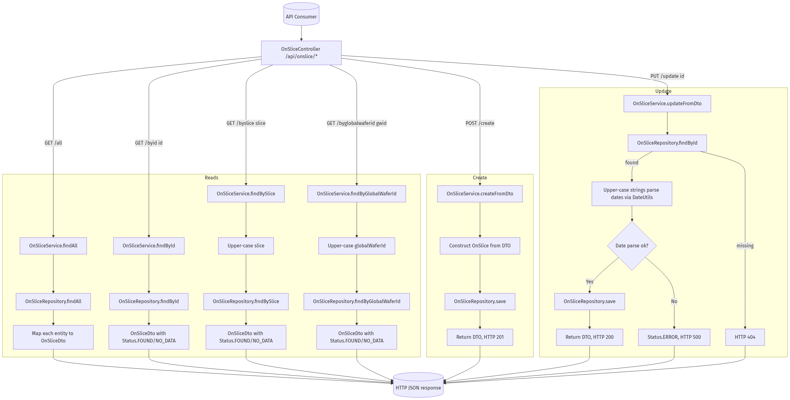

# OnSlice Retrieval & Maintenance

Behaviour of the `OnSlice` REST layer and the persistence rules that back slice, puck, and wafer identifiers.

## REST Entry Points

- `GET /api/onslice/all` – retrieves every cached row through `OnSliceService.findAll` → `OnSliceRepository.findAll`.
- `GET /api/onslice/byid/{id}` – fetches a record by surrogate key.
- `GET /api/onslice/byslice/{slice}` – canonical lookup based on the slice identifier.
- `GET /api/onslice/byglobalwaferid/{globalWaferId}` – resolves a slice when only the global wafer ID is known.
- `POST /api/onslice/create` – inserts a new record from an `OnSliceDto` payload.
- `PUT /api/onslice/update/{id}` – updates selected fields of an existing record.

Each controller method upper-cases incoming identifiers (where applicable) before delegating to `OnSliceService`. Responses are wrapped in `OnSliceDto`, carrying status flags for clients.



## Read Path (`findBy*`)

1. **Input normalisation** – controller upper-cases `slice` and `globalWaferId` when present.
2. **Repository query** – `OnSliceService` hands off to `OnSliceRepository` (`findAll`, `findById`, `findBySlice`, `findByGlobalWaferId`). There are no remote calls or enrichment passes.
3. **Status derivation** – controller inspects the optional result and sets `Status.FOUND` when present or `Status.NO_DATA` when absent. Exceptions bubble up as `Status.ERROR` with a message.

## Create Path (`createFromDto`)

1. **DTO mapping** – `OnSliceService.createFromDto` constructs a domain entity via the `OnSlice(OnSliceDto)` constructor.
2. **Persistence** – `OnSliceRepository.save` writes the row and returns the managed entity.
3. **Response** – service wraps the saved entity in a DTO and responds with HTTP 201.

## Update Path (`updateFromDto`)

1. **Lookup** – controller resolves the existing entity with `findById`. Missing rows trigger HTTP 404 before any updates are attempted.
2. **Selective field updates** – `OnSliceService.updateFromDto` copies only non-null DTO fields, upper-casing text values and parsing date fields via `DateUtils`.
3. **Validation** – `DateUtils.convertStringToDate` guards `SliceStartTime` and `InsertTime`; parsing failures return `Status.ERROR` with HTTP 500.
4. **Persistence & Status** – successful saves return HTTP 200 with the refreshed DTO and `Status.FOUND` inferred from the entity; errors surface as `Status.ERROR`.

## Data Fields & Transformations

| Field | Notes |
| --- | --- |
| `slice`, `puckId`, `runId`, `sliceSourceLot`, `startLot`, `fabWaferId`, `fabSourceLot`, `slicePartname`, `sliceLottype`, `sliceSuplierid` | Converted to upper-case when updated to keep canonical formatting. |
| `sliceStartTime`, `insertTime` | Parsed using `DateUtils`. Invalid formats stop the update with `Status.ERROR`. |
| `puckHeight` | Passed through as-is (floating-point height metric). |
| `globalWaferId` | Stored as provided; used for lookups via `/byglobalwaferid`. |

## Status Semantics

- `FOUND` – successful read or update; DTO contains populated entity data.
- `NO_DATA` – repository returned empty result set for requested key.
- `ERROR` – exception encountered (parsing, persistence, or unexpected runtime failure).

## Regenerating the Diagram

Mermaid source lives in `docs/onslice-dataflow.mmd`. After edits run:

```bash
jq -Rs '{diagram_source: .}' docs/onslice-dataflow.mmd > /tmp/onslice-dataflow.json
curl -s -H 'Content-Type: application/json' --data @/tmp/onslice-dataflow.json \
  https://kroki.io/mermaid/png --output docs/onslice-dataflow.png
```
